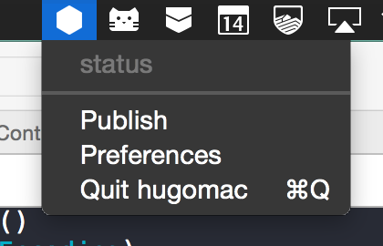

# hugomac

Hugomac is an osx menubar app to publish your blog directly to Amazon S3. It uses the wonderful [Hugo](https://github.com/spf13/hugo) static site generator to create your blog without having to touch a command line.

Here's the general idea:

* You keep a directory of (somewhat) publisher-agnostic markdown files in dropbox, git, iCloud or just sitting in your Documents folder
* You pick a folder where you have a hugo theme (maybe near your documents, maybe from git, it doesn't matter)
* You hugomac to generate your site and publish it to an S3 bucket which has website hosting turned on

That's it. 

### installation

* clone the source
* do a `pod install` to get the deps from Cocoapods
* open the `.xcworkspace` file and build/run

### S3 setup

* create an S3 bucket and enable it for website hosting
* get some S3 credentials that have write access to that bucket

### content setup

* make a new folder and create some posts with this [front matter format](http://gohugo.io/content/front-matter/)

### theme setup

* find a hugo theme, download it to a folder

### hugomac setup

* pick your content directory in hugomac preferences
* pick your theme directory in hugomac preferences
* configure hugomac with the bucket name and credentials

Publish!
